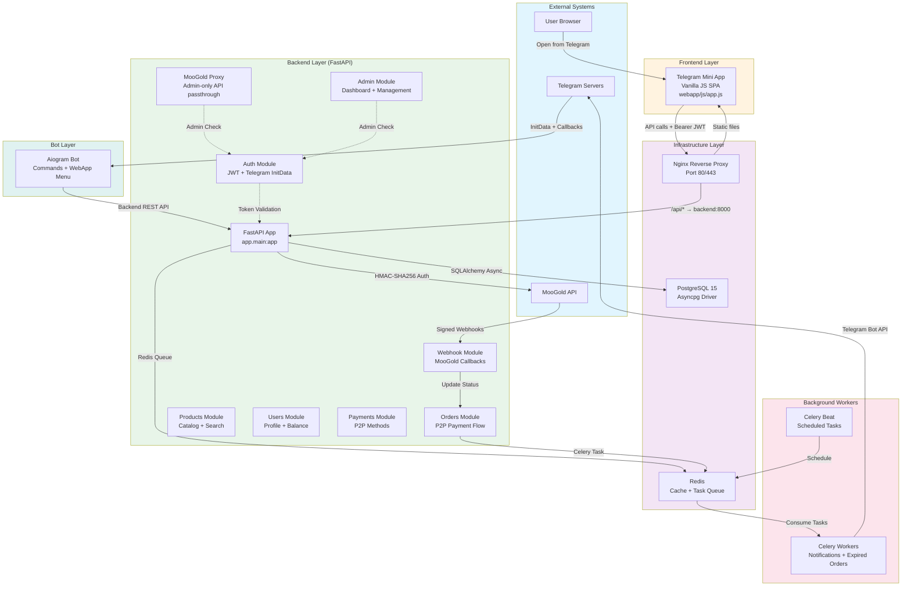
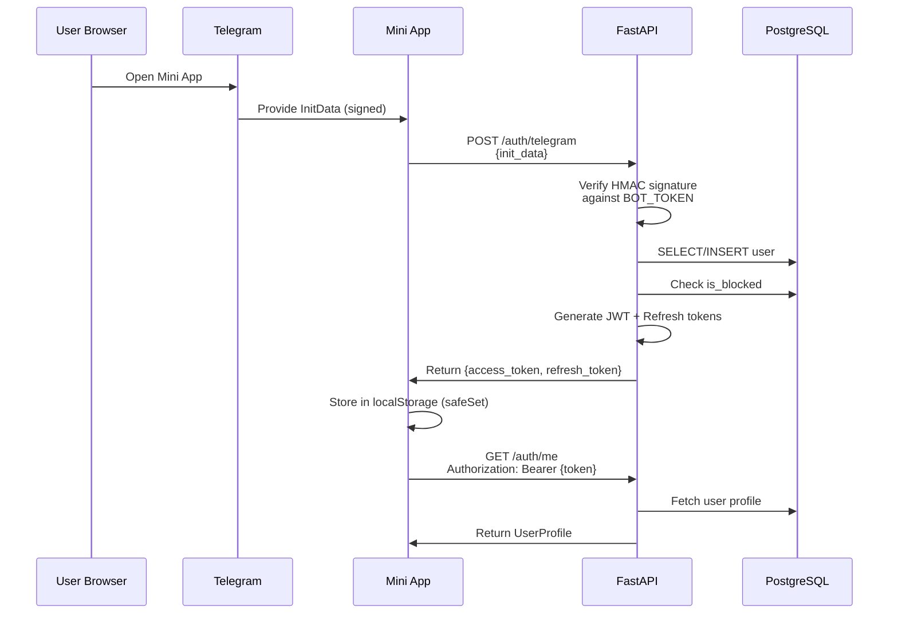
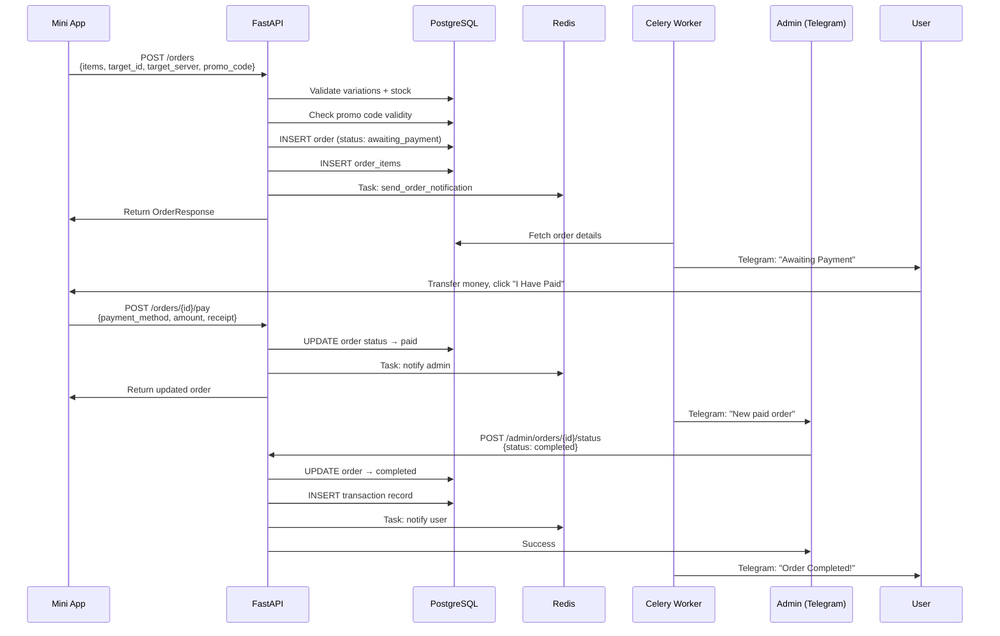
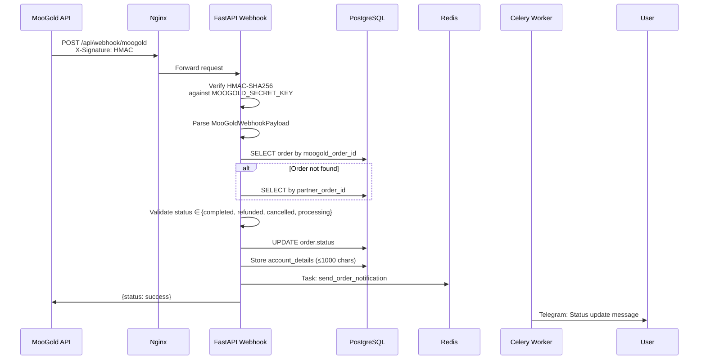
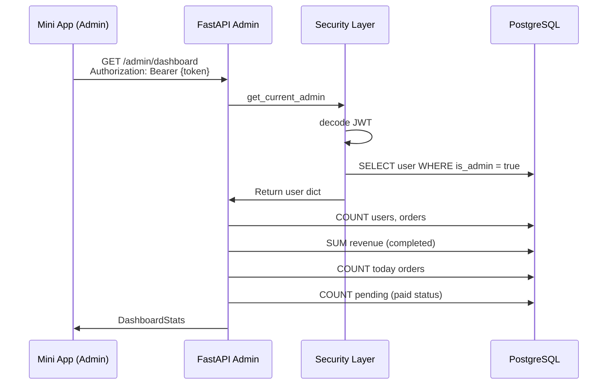
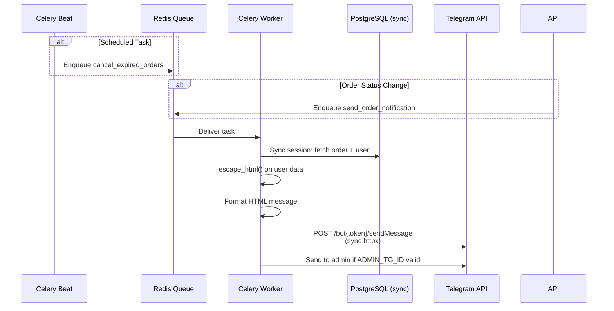
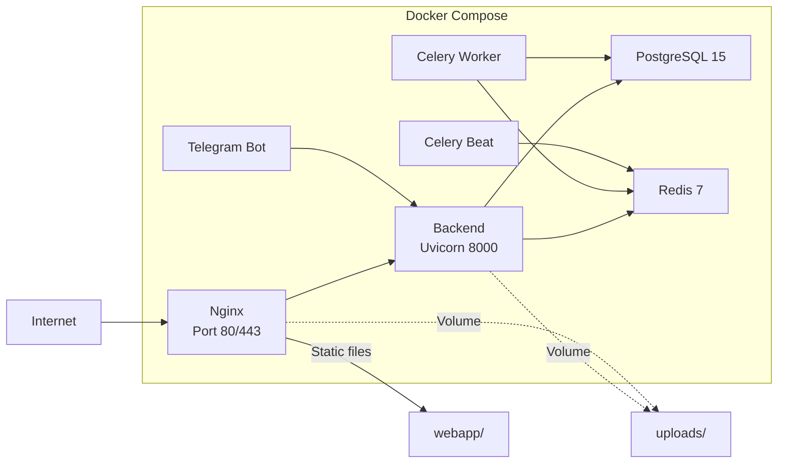

# TG Shop — Architecture Documentation

> Generated from GitNexus Knowledge Graph
> Index: 1,035 nodes | 1,834 edges | 77 execution flows | 18 functional clusters

## Overview

TG Shop is a Telegram Mini App shop for virtual goods (game top-ups, gift cards, Telegram Stars/Premium). It integrates with the **MooGold API** for order fulfillment.

The architecture follows a classic three-tier pattern with async processing:
- **Frontend**: Vanilla JS Telegram Mini App (SPA)
- **Backend**: FastAPI with SQLAlchemy async ORM
- **Bot**: Aiogram for Telegram interactions
- **External**: MooGold API for product fulfillment

## Functional Areas

| Area | Symbols | Cohesion | Files | Purpose |
|------|---------|----------|-------|---------|
| **Services** | 18 | 1.0 | `moogold.py`, `notifications.py` | External API client + Celery tasks |
| **Models** | 11 | 1.0 | `models.py`, `base.py` | SQLAlchemy ORM entities |
| **Bot** | 11 | 1.0 | `bot/main.py`, `backend_client.py` | Telegram bot handlers |
| **API** | 11 | 1.0 | `auth.py`, `orders.py`, `admin.py`, etc. | FastAPI route handlers |
| **Schemas** | 9 | 1.0 | `schemas.py` | Pydantic request/response models |
| **Mini App JS** | 45 | 0.47–0.72 | `app.js`, `index.html`, `style.css` | Frontend SPA logic |
| **Alembic** | 4 | 1.0 | `alembic/` | Database migrations |
| **Core** | 5 | 1.0 | `config.py`, `security.py`, `database.py`, `limiter.py` | Shared infrastructure |

## Tech Stack

| Layer | Technology |
|-------|-----------|
| Backend Framework | FastAPI 0.111.0 |
| ORM | SQLAlchemy 2.0 (async) |
| Database | PostgreSQL 15 |
| Cache/Queue | Redis 7 |
| Task Queue | Celery 5.4 |
| Bot Framework | Aiogram |
| HTTP Client | httpx |
| Auth | JWT + Telegram InitData HMAC |
| Rate Limiting | slowapi |
| Reverse Proxy | Nginx |
| Frontend | Vanilla JS (SPA) |
| CSS | Custom glassmorphism theme |

## System Architecture

## API Routes (31 Endpoints)

| Prefix | Routes | Module | Auth |
|--------|--------|--------|------|
| `/api/auth` | `/telegram`, `/refresh`, `/me` | Auth | Telegram InitData / JWT |
| `/api/products` | `/categories`, `/{id}`, `/category/{slug}` | Products | Public |
| `/api/orders` | `/`, `/my`, `/{id}`, `/{id}/pay`, `/apply-promo` | Orders | JWT |
| `/api/payments` | `/methods`, `/methods/{id}` | Payments | JWT |
| `/api/users` | `/profile`, `/balance`, `/transactions`, `/referral-link` | Users | JWT |
| `/api/admin` | `/dashboard`, `/orders`, `/products`, `/users`, etc. | Admin | Admin JWT |
| `/api/moogold` | `/order`, `/order-detail`, `/products`, `/balance` | MooGold Proxy | Admin JWT |
| `/api/webhook` | `/moogold` | Webhook | HMAC Signature |
| `/api/health` | `/` | Health | Public |

## Key Execution Flows

### 1. User Authentication Flow

**Key Security:**
- Telegram InitData HMAC verification with 24h freshness check
- JWT tokens: 15min access, 7-day refresh
- Admin status re-checked from database on every admin request (stale token protection)
- Rate limiting: 5 requests/minute on `/auth/telegram`

### 2. Place Order + P2P Payment Flow

**Key Logic:**
- Quantity validation: 1–10 per item
- Payment amount must match order total (±0.01)
- Order can only be paid once (status == awaiting_payment)
- Only admin can move from paid → completed

### 3. MooGold Webhook Flow

**Key Security:**
- HMAC-SHA256 signature verification on every webhook
- Status whitelist: only 4 valid statuses accepted
- Payload size limits on account_details

### 4. Admin Dashboard Flow

**Key Security:**
- Admin token validated + database re-check on every request
- No hardcoded admin logic — all admin checks query DB

### 5. Celery Notification Flow

**Key Points:**
- Celery uses sync SQLAlchemy engine (psycopg2) because Celery tasks run in sync context
- HTML escaping before Telegram sendMessage (prevents XSS via Telegram HTML parse_mode)
- Graceful handling of missing/invalid ADMIN_TG_ID

## Data Model

### Core Entities

| Entity | Key Fields | Relationships |
|--------|-----------|--------------|
| **User** | telegram_id, username, balance, is_admin, is_blocked, referral_code | → orders, transactions |
| **Category** | moogold_id, name, slug, icon, sort_order | → products |
| **Product** | moogold_id, category_id, name, description, image_url | → category, variations |
| **ProductVariation** | product_id, name, price, stock_status | → product, order_items |
| **Order** | order_number, user_id, status, total_amount, discount_amount, target_id, target_server, moogold_order_id, partner_order_id | → user, items, transactions |
| **OrderItem** | order_id, variation_id, quantity, unit_price, total_price | → order, variation |
| **Transaction** | user_id, order_id, type, amount, status, description | → user, order |
| **PromoCode** | code, type, value, min_order_amount, max_discount, usage_limit, usage_count, valid_from, valid_until | — |
| **PaymentMethod** | name, details, instructions, sort_order | — |

### Database Constraints

Added `CheckConstraint` on key numeric fields:
- `ProductVariation.price >= 0`
- `Order.total_amount >= 0`, `payment_amount >= 0`, `discount_amount >= 0`
- `OrderItem.quantity > 0`, `unit_price >= 0`, `total_price >= 0`
- `Transaction.amount >= 0`
- `PromoCode.value >= 0`, `min_order_amount >= 0`, `max_discount >= 0`, `usage_limit >= 0`

## Deployment

## Security Architecture

| Layer | Measures |
|-------|----------|
| **Auth** | Telegram InitData HMAC + JWT (HS256, 32+ char secret) |
| **Admin** | DB re-check on every request (no stale tokens) |
| **Rate Limiting** | 5/min on auth endpoints via slowapi |
| **CORS** | Restricted to FRONTEND_URL + *.telegram.org |
| **Webhooks** | HMAC-SHA256 signature verification |
| **XSS** | `escapeHtml()` helper on all Mini App innerHTML |
| **Input Validation** | Pydantic schemas + manual validation on all endpoints |
| **Database** | SQLAlchemy ORM (no raw SQL), CheckConstraints on numeric fields |
| **Notifications** | HTML escaping before Telegram sendMessage |

## Configuration

Critical env vars (validated at startup):
- `JWT_SECRET` — must be ≥32 characters
- `BOT_TOKEN` — validated format (Telegram bot tokens start with `7`)
- `MOOGOLD_PARTNER_ID` + `MOOGOLD_SECRET_KEY` — for API auth
- `ADMIN_TG_ID` — numeric Telegram ID for first admin

---

*Generated: 2026-06-10 via GitNexus Knowledge Graph*
*Index: 1,035 nodes | 1,834 edges | 77 flows | 18 clusters*